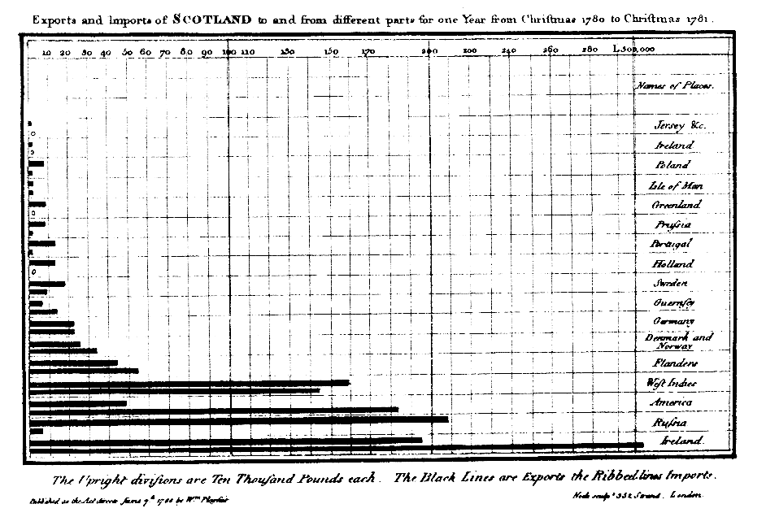

## Datenjournalismus NRW
Ein Gemeinschaftsprojekt von correctiv.org und der LfM-Stiftung Vor Ort NRW.

## Vor Ort NRW
*LfM-Stiftung für Lokaljournalismus*
- gemeinnützig
- staatsfern und unabhängig
- für Vielfalt im Lokal- und Regionaljournalismus in NRW
- Rundfunk, TV, Internet

## Vor Ort NRW
- Vernetzung
- Förderung von Qualifizierung
- Veranstaltungen
- Preis für herausragende lokaljournalistische Online-Angebote
- Expertisen (z. B. "Handbuch des selbstbestimmten Lokaljournalismus im Netz")

## Datenjournalismus NRW
- 5 fellows
- Regionalredaktionen NRW
- Tutorials: Wissensplattform
- Meetups
- gemeinsames Großprojekt

## correctiv.org
- gemeinnützig
- unabhängig
- nicht gewinnorientiert

## correctiv.org
- 16 investigative Journalisten
- Veröffentlichungen mit Medienpartnern

## correctiv.org
- Flucht und Migration
- Pflegeheime
- Euros für Ärzte
- TTIP – Die Fakten
- Sparkassen

## correctiv.org
- Buchveröffentlichungen
- Veranstaltungen
- Bildungsprogramme

## Datenjournalismus

> 

> 

> 

> 

> 

> 

## Datenjournalismus
- Auswertung, Analyse
- neue Themen gewinnen
- Visualisierung, interaktiv

> 

## Datenjournalismus NRW

> 

## Wie giftig ist NRW?

### Wie giftig ist NRW?
- Boden
- Wasser
- Luft

### Daten
- LANUV, Umweltbundesamt

> 

> 

> 

## Wissensplattform

> 

> 

## Chancen für Lokaljournalismus

## Was macht mein Nachbar?

> 

> 

## Chancen Datenjournalismus
- Zusammenarbeit
- Wissensaustausch
- Transparenz
- User-Interaktion
- niemals "fertig"

## Chancen von interaktiven Portalen
- Weiterdrehen
- eigene Geschichten finden

# ???

https://correctiv.org/ddj

@LfMNRW

@correctiv_org

@simonwoerpel
